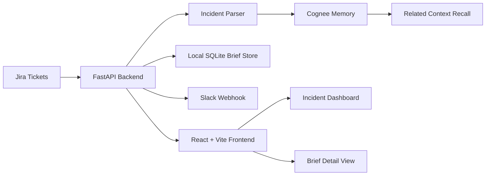

# Throughline

Throughline is a Cognee-powered memory layer for support engineering. It turns resolved Jira escalations into reusable incident memory, then uses that memory to help teams recognize repeat issues faster when a new customer ticket arrives.

Instead of treating every escalation like a blank page, Throughline remembers the customer, product component, error pattern, root cause, fix, owner, and supporting evidence from past incidents. When a similar Jira ticket is imported later, the app surfaces the previous context and gives the support engineer a grounded starting point.

## Why It Matters

Support teams lose time because the answer to a new escalation often already exists somewhere: an old Jira ticket, a pull request, a Slack thread, or a teammate's memory. The hard part is finding the right prior incident at the right moment.

Throughline solves that by building a graph-style memory around incidents. It is especially useful for SaaS and healthcare operations teams where repeat failures can affect the same customer workflows over time.

## Why Cognee

Cognee is the memory engine behind Throughline. The project uses Cognee to store incident knowledge as connected context instead of flat notes. That matters because real escalations are not just keywords. They connect a customer, a component, an error class, a root cause, a fix, an owner, and future follow-up tickets.

Throughline uses Cognee for four core memory actions:

- Remember: ingest a resolved Jira ticket and store the incident as reusable memory.
- Recall: compare a new Jira escalation against past incidents and surface related context.
- Improve: capture user feedback when the recalled context is helpful or needs correction.
- Forget: remove customer-specific memory when a reset, demo cleanup, or privacy action is needed.

## Demo Story

The recommended demo uses a patient management system scenario.

1. A historical Jira ticket documents a resolved issue where appointment reminders stopped after a provider timezone change.
2. Throughline imports that resolved Jira ticket and stores it in Cognee memory.
3. A new Jira ticket arrives from the same clinic with missing SMS appointment reminders.
4. Throughline recalls the older incident and shows the likely relationship, prior root cause, fix, owner, and evidence.
5. An unrelated insurance eligibility ticket can be imported to show that Throughline does not force a match when the context is different.

This gives judges a practical story: the app helps a support engineer avoid rediscovering an old production issue from scratch.

## Core Features

- Real Jira import using Jira issue keys or URLs.
- Cognee-backed incident memory for resolved support issues.
- Similarity recall for new escalations.
- Customer, component, error class, root cause, fix, and owner extraction from ticket descriptions.
- Incident dashboard with current imported briefs.
- Brief detail page with recalled context and evidence.
- Slack escalation sharing through an incoming webhook.
- Customer-level forget/reset workflow for demo cleanup and privacy.
- Feedback capture to mark recalled context as helpful or corrected.
- Local SQLite dashboard state plus Cognee memory state.

## Architecture



## Tech Stack

- Frontend: React, TypeScript, Vite
- Backend: FastAPI, Python
- Memory: Cognee
- Persistence: SQLite for local brief state
- Integrations: Jira REST API, Slack incoming webhook
- Demo workflow: local app with real Jira tickets

## Setup

Create and activate the Python environment:

```powershell
python -m venv .venv
.\.venv\Scripts\python.exe -m pip install -r requirements.txt
```

Install the frontend dependencies:

```powershell
cd frontend
npm install
cd ..
```

Create a `.env` file from the example:

```powershell
Copy-Item .env.example .env
```

Required environment variables:

```env
LLM_API_KEY=your_llm_key
THROUGHLINE_PUBLIC_BASE_URL=http://localhost:5173

JIRA_SITE_URL=https://your-domain.atlassian.net
JIRA_EMAIL=your-email@example.com
JIRA_API_TOKEN=your_jira_api_token
JIRA_WEBHOOK_SECRET=optional_shared_secret

SLACK_WEBHOOK_URL=https://hooks.slack.com/services/...
```

## Run Locally

Start the API:

```powershell
.\.venv\Scripts\python.exe -m uvicorn api.app:app --host 127.0.0.1 --port 8000 --reload
```

Start the frontend in a second terminal:

```powershell
cd frontend
npm run dev
```

Open:

```text
http://127.0.0.1:5173/
```

## Fresh Demo Reset

Use this when recording a clean Jira-only demo:

```powershell
@'
import asyncio
from throughline.memory import reset_memory
asyncio.run(reset_memory())
print("cognee reset complete")
'@ | .\.venv\Scripts\python.exe -

Remove-Item .throughline\throughline.db -Force -ErrorAction SilentlyContinue
Remove-Item .throughline\throughline.db-shm -Force -ErrorAction SilentlyContinue
Remove-Item .throughline\throughline.db-wal -Force -ErrorAction SilentlyContinue
```

Restart the API after resetting.

## Jira Ticket Format

Throughline works best when Jira descriptions include structured incident details. For the PMS demo, create tickets like this:

```text
Customer: Northstar Clinic
Component: AppointmentReminderService
Error: ReminderTimezoneDrift
Status: Resolved
Root cause: Reminder jobs used the clinic account timezone, but provider schedules were saved with a newer provider-level timezone after the calendar settings migration.
Fix: PR #184 normalized reminder job execution to provider timezone and added a fallback to clinic timezone only when provider timezone is missing.
Owner: Sidharth
Impact: Patients with morning appointments did not receive SMS reminders, causing increased no-shows.
```

New related ticket:

```text
Customer: Northstar Clinic
Component: AppointmentReminderService
Error: ReminderTimezoneDrift
Status: Open
Problem: SMS appointment reminders are not being sent for newly booked appointments.
Observed behavior: Appointments appear in the provider calendar, but reminder delivery logs show no scheduled SMS job.
Need: Check whether this matches the previous provider timezone reminder issue.
Impact: Clinic staff report higher no-shows for morning appointments.
```

Unrelated ticket:

```text
Customer: Riverbend Health
Component: InsuranceEligibilityService
Error: EligibilityCacheStale
Status: Open
Problem: Insurance eligibility status does not refresh after staff re-run verification.
Observed behavior: PMS shows old inactive coverage even after payer API returns active coverage.
Need: Investigate eligibility cache invalidation after manual verification.
Impact: Front desk staff may incorrectly ask patients to self-pay.
```

## Suggested Judge Demo Flow

1. Show the Jira tickets first so the demo feels real.
2. Open Throughline and confirm the dashboard is empty after reset.
3. Import the resolved Jira ticket to teach Throughline the past incident.
4. Import the new related Jira ticket.
5. Open the generated brief and show the recalled prior incident, root cause, fix, owner, and evidence.
6. Import the unrelated Jira ticket to show that unrelated context stays separate.
7. Share the brief to Slack and mark the recall as helpful or corrected.
8. Use customer forget/reset to show the memory lifecycle.

## API Highlights

- `GET /integrations` checks Jira and Slack configuration.
- `GET /briefs` lists imported incident briefs.
- `GET /briefs/{brief_id}` returns one brief.
- `POST /integrations/jira/issues/{issue_key}/brief` imports a Jira issue and creates a brief.
- `POST /briefs/{brief_id}/feedback` records helpful or corrected recall feedback.
- `POST /briefs/{brief_id}/share/slack` sends an escalation summary to Slack.
- `POST /customers/{name}/forget` removes customer memory and local briefs.

## Hackathon Positioning

Throughline is not a generic chatbot. It is a focused support workflow that uses Cognee as long-term operational memory. The project demonstrates how memory can become part of the escalation process: remember a resolved incident, recall it during a similar future ticket, improve the memory with feedback, and forget customer data when needed.

The result is a practical demo for support, customer success, and engineering teams that need faster incident triage with less repeated investigation.
